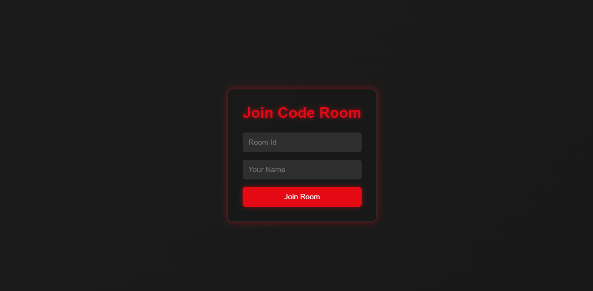
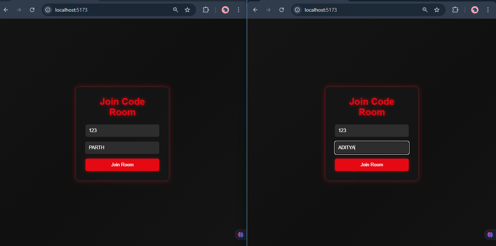
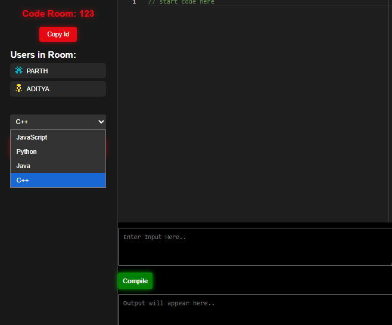

# CODE-EDITOR

A **Realtime Collaborative Code Editor** built with **React**, **Socket.IO**, and **Monaco Editor** that allows multiple users to **write, edit, and run code together** in real time.  
Supports **C++**, **Python**, **Java**, and **JavaScript** with live compilation via the **Piston API**.  

---

## 📌 Features

- **💻 Real-time Collaboration** – Multiple users can edit the same code simultaneously.
- **🌐 Multi-language Support** – C++, Python, Java, JavaScript.
- **⚡ Live Compilation** – Instantly execute code using the [Piston API](https://github.com/engineer-man/piston).
- **👀 Typing Indicators** – See when another user is typing.
- **🏠 Room System** – Create or join rooms to work together.
- **📥 Input Console** – Send custom input to the program.
- **📤 Output Console** – View program output instantly.
- **🎨 Syntax Highlighting** – Powered by Monaco Editor.

---

### Technologies Used

### Frontend
- React  
- Socket.IO Client  
- Monaco Editor  
- CSS3  

### Backend
- Node.js  
- Express  
- Socket.IO  
- Axios  
- Piston API  


---

## 📂 Project Structure

```plaintext
CODE-EDITOR/
│
├── backend/          # Node.js + Express + Socket.IO + Piston API
│   ├── server.js     # Main backend entry point
│   ├── package.json  # Backend dependencies
│   └── ...
│
├── frontend/         # React + Monaco Editor
│   ├── src/
│   │   ├── App.jsx   # Main React component
│   │   ├── App.css   # Styling
│   │   └── ...
│   ├── package.json  # Frontend dependencies
│   └── ...
│
└── README.md         # Project documentation
 ```

### Screenshots

### 1. Join Code Room - Login Screen

Initial screen where users enter a **Room ID** and **Name** to join the coding session.

### 2. Two Users Joining Same Room

Two different users (PARTH and ADITYA) are entering the same room (`Room ID: 123`) from separate browser windows.

### 3. Shared Code Editor with User List

Both users are now in the same room and can see the same editor, user list, input area, and compile button in real-time.

### 4. Language Dropdown

Users can choose from multiple programming languages like JavaScript, Python, Java, and C++ for compiling and testing their code.


## ⚙️ Installation & Setup

### 1️⃣ Clone the Repository
```bash
git clone https://github.com/YOUR_USERNAME/CODE-EDITOR.git
cd CODE-EDITOR
```

### Install Backend Dependencies in root directory
```bash
npm init -y
npm install express socket.io axios dotenv
npm i- D nodemon
```


### Install Backend Dependencies in backend directory and running backend file
```bash
npm install
node index.js
```


### Install frontend Dependencies in frontend directory and running frontend file
```bash
npm install
npm run dev
```


